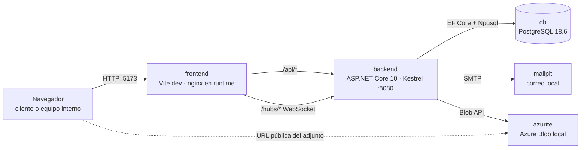

# Arquitectura general

DataTicket es un **monolito modular** (PRD §13, fase 0) en un **monorepo contenedorizado**: un backend .NET 10 con arquitectura hexagonal, un frontend React 19 con arquitectura MVC y PostgreSQL 18, orquestados con Docker Compose ([[adr-0001-monorepo-contenedorizado]]).

## Vista de contenedores

- El navegador **solo habla con el origen del frontend**. Vite (desarrollo) y nginx (imagen runtime) reenvían `/api` y `/hubs` al backend. Resultado: cookies de Identity *same-origin*, WebSockets de SignalR sin CORS ([[adr-0004-autenticacion-cookie-mismo-origen]]).
- Los adjuntos se sirven por **URL pública permanente** del Blob, fuera de la autorización del portal: riesgo aceptado en [[adr-0006-urls-publicas-azure-blob]].
- Una sola instancia del backend en el MVP: SignalR sin backplane (PRD §7).

## Capas por contenedor

| Contenedor | Arquitectura | Página |
|---|---|---|
| `backend` | Hexagonal: `Domain` ← `Application` (puertos) ← `Infrastructure` / `Api` (adaptadores) | [[backend-hexagonal]] |
| `frontend` | MVC por módulo: `models` → `controllers` (hooks) → `views` | [[frontend-mvc]] |
| `db` | Esquema gestionado por migraciones de EF Core | [[persistencia-postgresql]] |

## Flujos transversales

- **Autenticación y permisos**: Identity con cookie; autorización por empresa, rol y participación en el servidor → [[autenticacion-identity]], [[roles-y-permisos]].
- **Chat en tiempo real**: SignalR distribuye; PostgreSQL es la fuente del historial → [[tiempo-real-signalr]], [[chat-interno]].
- **Auditoría**: cada caso de uso relevante deja una entrada append-only → [[auditoria]].

## Estado actual (2026-10-07)

Esqueleto de la fase 0 en marcha: solución .NET con las cuatro capas y pruebas de arquitectura, SPA con un módulo MVC de ejemplo (`system/health`), endpoint `/api/health` que verifica PostgreSQL y Compose con los cinco servicios verificados ([[analisis-prd-vs-docker-compose]]). Identity, SignalR, dominio y migraciones aún no están implementados.

## Relacionado

- [[vision-general]] · [[stack-y-versiones]] · [[entorno-docker]] · [[fases-y-alcance]]
