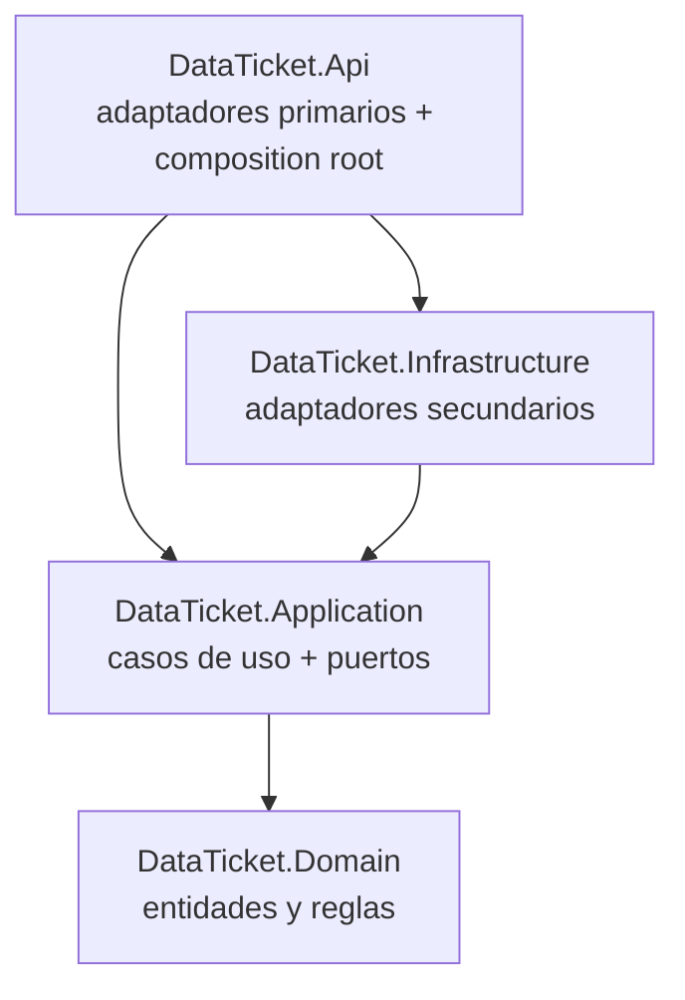

# Backend hexagonal

El backend (`backend/`, C# sobre .NET 10) sigue **puertos y adaptadores**: el dominio y los casos de uso no conocen la web, la base de datos ni SignalR; todo lo externo entra o sale por interfaces ([[adr-0002-backend-hexagonal]]).

## Proyectos y regla de dependencias

| Proyecto | Contiene | Puede depender de |
|---|---|---|
| `DataTicket.Domain` | Entidades, value objects, enums, invariantes ([[modelo-de-dominio]]) | Nada |
| `DataTicket.Application` | `Ports/In` (casos de uso), `Ports/Out` (repositorios, `IEmailSender`, `IFileStorage`, `ITicketChatNotifier`, `ICurrentUser`, `IClock`), implementación de casos de uso, DTOs | `Domain` + abstracciones de DI |
| `DataTicket.Infrastructure` | `Persistence/` (EF Core, configuraciones, migraciones), `Identity/`, `Storage/` (Blob), `Email/` (SMTP) | `Application`, EF Core, Npgsql, ASP.NET Core |
| `DataTicket.Api` | `Endpoints/` (minimal APIs), `Realtime/` (hub `/hubs/tickets` y notificador), `Health/`, `Program.cs` | `Application`, `Infrastructure` |

La regla se **verifica en cada `dotnet test`** (ejecutado dentro de `backend/`) con `tests/DataTicket.ArchitectureTests/LayerDependencyTests.cs`: `Domain` y `Application` no pueden referenciar `Microsoft.AspNetCore*`, `Microsoft.EntityFrameworkCore*` ni `Npgsql`; `Infrastructure` no puede referenciar `Api`.

## Mapa funcional → puertos (propuesta)

| Funcionalidad | Puerto de entrada (caso de uso) | Puertos de salida | Adaptadores |
|---|---|---|---|
| Radicación ([[flujo-del-ticket]]) | `SubmitTicket` | `ITicketRepository`, `IFileStorage`, `IAuditLog` | HTTP · EF Core · Blob |
| Triage y participantes | `AssignParticipants`, `RemoveParticipant`, `TakeTicket` | `ITicketRepository`, `IEmailSender`, `IChatConnectionRevoker` | HTTP · EF Core · SMTP · SignalR |
| Chat ([[chat-interno]]) | `SendChatMessage`, `MarkMessageRead`, `GetChatHistory` | `IChatRepository`, `ITicketChatNotifier` | Hub · EF Core · SignalR |
| Respuesta formal y cierre | `DeliverFormalResponse`, `CloseTicket` | `ITicketRepository`, `IEmailSender`, `IAuditLog` | HTTP · EF Core · SMTP |
| Portal cliente | `ListClientTickets`, `GetClientTicket` | `IClientTicketQueries` | HTTP · EF Core |

Nombres según [[glosario]]. Es una guía de partida: se ajusta al implementar y se documenta aquí.

## Convenciones

- Código en inglés; mensajes y comentarios en español.
- `Directory.Build.props`: `net10.0`, `Nullable`, `ImplicitUsings`, **`TreatWarningsAsErrors`**.
- `Directory.Packages.props`: versiones centralizadas (los `.csproj` no llevan `Version`).
- `global.json`: SDK 10.0.x (`rollForward: latestFeature`) y `test.runner = Microsoft.Testing.Platform`.
- Autorización dentro de los casos de uso con `ICurrentUser`; las políticas de endpoint son la primera barrera, no la única ([[roles-y-permisos]]).
- Configuración tipada con el patrón Options. Claves esperadas: `ConnectionStrings:DataTicket`, `Email:Smtp:*`, `Email:FromAddress`, `Storage:Blob:*` ([[entorno-docker]]).

## Cómo añadir una funcionalidad

1. Prueba de dominio/caso de uso que falle (TDD, [[estrategia-de-pruebas]]).
2. Entidad o regla en `Domain`; caso de uso y puertos en `Application`.
3. Adaptadores en `Infrastructure` (y migración si cambia el esquema, [[persistencia-postgresql]]).
4. Endpoint o método del hub en `Api`; registro en `AddApplication()` / `AddInfrastructure()`.
5. Si se crea un proyecto nuevo: agregarlo a `DataTicket.slnx`, a la etapa `restore` del `backend/Dockerfile` y a las pruebas de arquitectura.

## Estado actual

| Elemento | Estado |
|---|---|
| Cuatro proyectos + regla de dependencias (5 pruebas) | Hecho |
| `DataTicketDbContext` (vacío) + health check de PostgreSQL | Hecho |
| `GET /api/health/live` (proceso), `GET /api/health` (checks `ready`; detalle solo en Development), OpenAPI en Development | Hecho |
| Avisos de vulnerabilidad NuGet (NU1901–NU1904) visibles pero sin romper el build | Hecho |
| Identity, dominio, casos de uso, SignalR, migraciones | Pendiente (fase 0–2) |

## Relacionado

- [[arquitectura-general]] · [[autenticacion-identity]] · [[tiempo-real-signalr]] · [[persistencia-postgresql]] · [[stack-y-versiones]]
