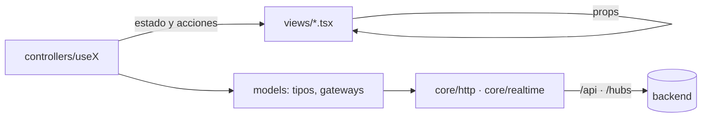

# Frontend MVC

El frontend (`frontend/`, React 19 + TypeScript sobre Vite y Node 24) organiza cada funcionalidad en **Modelo, Controlador y Vista** ([[adr-0003-frontend-mvc]]). React es la capa de vista; los controladores son hooks y los modelos son TypeScript puro.

## Estructura

```text
frontend/src/
├── main.tsx                 arranque
├── app/                     App, layout y (más adelante) rutas: conecta controladores con vistas
├── core/http/httpClient.ts  fetch same-origin a /api con la cookie de sesión
├── core/realtime/           conexión SignalR compartida (cuando exista el chat)
├── modules/<modulo>/
│   ├── models/              tipos, normalización de datos externos, gateways (xxxGateway.ts)
│   ├── controllers/         hooks useXController: estado + acciones
│   └── views/               componentes puros (props → JSX)
├── shared/ui/               componentes visuales genéricos
└── styles/global.css        tokens provisionales (hasta el ZIP de diseño)
```



## Reglas (las hace cumplir `oxlint`)

| Capa | Puede importar | No puede importar |
|---|---|---|
| `models/` | `core/`, otros modelos | `react`, `react-dom`, `controllers/`, `views/` |
| `controllers/` | `react`, `models/`, `core/` | `views/` |
| `views/` | tipos de `models/` y `controllers/`, `shared/ui` | `core/`, `*Gateway`, `@microsoft/signalr` |

Configuradas con `no-restricted-imports` por carpeta en `frontend/.oxlintrc.json`; se comprobó que bloquean las cinco violaciones típicas (2026-10-07). `npm run lint` debe pasar antes de cada PR.

## Módulo de referencia: `system`

| Archivo | Rol |
|---|---|
| `models/health.ts` | Tipos y `toHealthSummary()`: normaliza el JSON de `/api/health` (estados desconocidos → `Unhealthy`) |
| `models/healthGateway.ts` | `fetchHealth()` sobre `core/http` (acepta 503 como respuesta válida) |
| `controllers/useHealthController.ts` | Estado discriminado `loading/ready/error`, cancelación con `AbortController`, `retry()` |
| `views/HealthStatusView.tsx` | Render puro con `role="status"`/`role="alert"` |
| `models/health.test.ts` | 3 pruebas Vitest |

## Integración con el backend

- Rutas relativas (`/api/...`, `/hubs/...`); nunca `http://localhost:8080` en el código. El proxy está en `vite.config.ts` (`VITE_API_PROXY_TARGET`) y en `frontend/nginx/default.conf.template`.
- Sesión por cookie `HttpOnly`; nada de tokens en `localStorage` ([[autenticacion-identity]]).
- SignalR con `@microsoft/signalr` (10.0.x) en `core/realtime`, reconexión automática y recuperación por cursor ([[tiempo-real-signalr]]).
- Superficies separadas: **portal del cliente** (estado resumido y respuesta formal) y **espacio interno** (triage, chat, dashboard). El portal nunca solicita datos internos ([[roles-y-permisos]]).

## Decisiones abiertas

- Enrutador: `react-router` 8.4.0 en modo librería, con rutas y guardas en `src/app` y sin `loader`/`action` para datos ([[adr-0010-enrutador-react-router]]). Librería de estado de servidor: no se adopta por ahora ([[pendientes]] §4).
- Estilo visual: tokens y componentes según [[sistema-de-diseno]] (inspiración `DataTicket.html`, [[adr-0011-estilo-visual-inspirado-en-el-prototipo]]).
- Testing Library + jsdom para pruebas de componentes cuando haya vistas con lógica de interacción.

## Relacionado

- [[arquitectura-general]] · [[backend-hexagonal]] · [[estrategia-de-pruebas]] · [[stack-y-versiones]]
