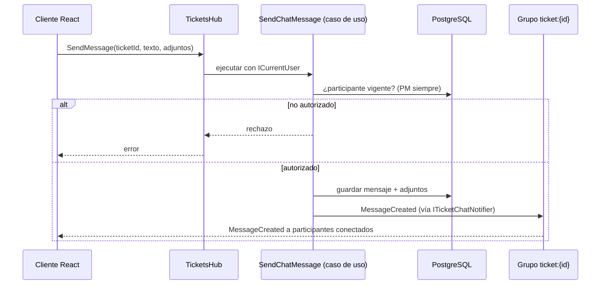

# Tiempo real con SignalR

Diseño técnico del [[chat-interno]]. **ASP.NET Core SignalR** distribuye eventos; **PostgreSQL guarda el historial** (PRD §7). Decisión en [[adr-0005-signalr-para-chat]]. Aún no implementado; la ruta de red (`/hubs` con upgrade a WebSocket por Vite y nginx) ya está verificada.

## Componentes

| Pieza | Ubicación | Nota |
|---|---|---|
| Hub `TicketsHub` en `/hubs/tickets` | `backend/src/DataTicket.Api/Realtime` | `[Authorize]`, cookie de Identity |
| Puerto `ITicketChatNotifier` | `Application/Ports/Out` | Lo implementa `Api/Realtime` con `IHubContext` |
| Casos de uso del chat | `Application` | Autorizan, persisten y luego notifican |
| API de historial por cursor | `GET /api/tickets/{id}/messages?after=<cursor>` | Carga inicial y recuperación tras reconexión |
| Cliente `@microsoft/signalr` | `frontend/src/core/realtime` | `withAutomaticReconnect()` |

Operaciones del hub: `JoinTicket`, `LeaveTicket`, `SendMessage`, `MarkAsRead`. Eventos al cliente: `MessageCreated`, `ReadReceiptUpdated`. Los nombres y el JSON definitivo se fijan al implementar (PRD §7) y se documentan aquí.

## Envío de un mensaje

## Reconexión

1. React carga el historial por API y guarda el cursor del último mensaje.
2. Conecta al hub y llama `JoinTicket`; el servidor valida la participación antes de añadir la conexión al grupo.
3. En `onreconnected`: `JoinTicket` de nuevo y `GET .../messages?after=<cursor>` para recuperar lo perdido (PRD §7.6, CA-05).

## Reglas de seguridad

- **Los grupos no son seguridad** (PRD §7): se valida participación en cada `JoinTicket`, `SendMessage` y `MarkAsRead`.
- **Persistir antes de publicar** (PRD §7.2).
- **Revocación**: al retirar un participante se desconectan o desautorizan sus conexiones activas (registro conexión → usuario) y no puede reconectarse (CA-06).
- Notificaciones dentro de la app por mensaje nuevo; **sin correo por mensaje** ([[notificaciones]]).

## Red y despliegue

- Desarrollo: `vite.config.ts` → `'/hubs': { target, ws: true }`.
- Runtime: `frontend/nginx/default.conf.template` → `Upgrade`/`Connection`, `proxy_read_timeout 1h`, `proxy_buffering off`.
- Una sola instancia: sin Redis/backplane en el MVP; al escalar, Redis o Azure SignalR (PRD §7, [[pendientes]]).

## Relacionado

- [[chat-interno]] · [[adr-0005-signalr-para-chat]] · [[autenticacion-identity]] · [[backend-hexagonal]] · [[frontend-mvc]]
