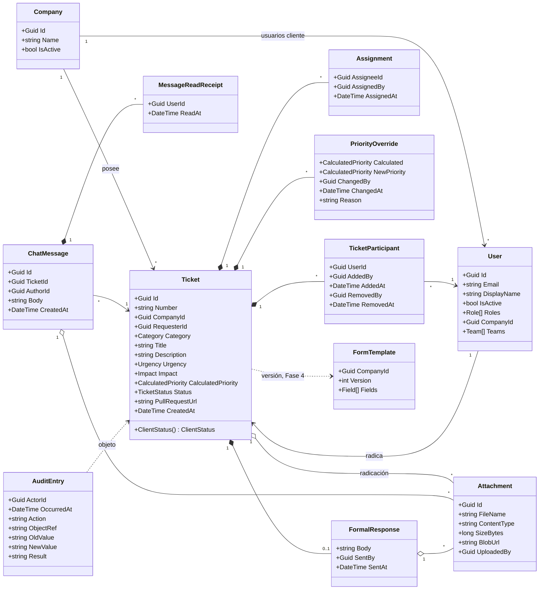

# Modelo de dominio

Modelo de dominio **propuesto**, derivado del PRD: agregados, entidades, campos clave e invariantes. Los nombres siguen el [[glosario]]; los que no están en él se marcan como propuesta.

> [!question] Propuesta a validar
> Este modelo no es una decisión aceptada. Es una síntesis del PRD para arrancar la implementación y debe validarse (y ajustarse aquí) durante las Fases 0 y 1. Los campos son orientativos; los nombres de propiedades y operaciones que no figuran en el [[glosario]] son sugerencias.

## Diagrama

## Agregados e invariantes

| Agregado (raíz) | Contiene | Invariantes clave |
|---|---|---|
| `Company` | — | Cada ticket pertenece a exactamente una empresa (PRD §12) |
| `User` (Identity: `ApplicationUser`) | Roles y equipos | Un usuario cliente pertenece a una sola empresa; los internos no tienen empresa *(propuesta)*. Sin registro público (PRD §5) |
| `Ticket` | `TicketParticipant`, `Assignment`, `PriorityOverride`, `FormalResponse`, adjuntos de radicación | Ver lista siguiente |
| `ChatMessage` | `MessageReadReceipt`, adjuntos | Ver lista siguiente |
| `AuditEntry` | — | Inmutable; solo se inserta (PRD §12) |
| `FormTemplate` (Fase 4) | Campos versionados | Un ticket conserva la versión con que se creó (PRD §9) |

`Category` se propone como catálogo o value object (sus valores no están en el PRD). `TriageQueue` e `Inbox` se proponen como **modelos de lectura** (consultas), no como agregados.

### `Ticket`

- `CompanyId` y `RequesterId` salen de la cuenta autenticada y no cambian (PRD §6.1).
- `Title` ≤ 120 caracteres (PRD §6.1).
- `CalculatedPriority` = matriz(`Urgency`, `Impact`); un ajuste exige `PriorityOverride` con motivo (PRD §6.1). Ver [[matriz-de-prioridad]].
- Nace en `New` (PRD §6.2). `ClientStatus` se **deriva** de `Status`, no se guarda aparte *(propuesta)*. Ver [[estados-del-ticket]].
- Detalle y chat solo para participantes vigentes, salvo el rol `ProductManager` (PRD §5, §6.2).
- Retirar un participante no borra su registro: se marca `RemovedAt` (PRD §5, §7).
- `FormalResponse` y el cierre solo los ejecutan `ProductManager` o `Administrator`; emitir la respuesta lleva a `SolutionDelivered` (PRD §5, §6.4, §6.5).
- `CloseTicket` es solo manual y guarda quién, cuándo y estado anterior (PRD §6.5). Exigir `SolutionDelivered` previo es *propuesta*.
- `PullRequestUrl` es manual e interna; nunca se expone al cliente (PRD §5, §6.3).

### `ChatMessage`

- El autor debe ser participante vigente (o `ProductManager`) al enviar (PRD §5, §7).
- Se persiste antes de publicarse en tiempo real (PRD §7). Ver [[tiempo-real-signalr]].
- Un `MessageReadReceipt` por (mensaje, persona), con fecha/hora; solo lo crea un participante vigente (PRD §7, §14.7).
- Se propone inmutable (el PRD no menciona edición ni borrado).

### `Attachment`

- Tipo ∈ {PDF, imagen, XML, Excel}; tamaño ≤ 10 MB; validado en backend (PRD §8).
- Solo metadatos y referencia en PostgreSQL; binario en Azure Blob con URL pública (PRD §8). Ver [[archivos-adjuntos]].

## `Assignment` frente a `TicketParticipant`

Propuesta: `Assignment` registra el acto de asignar responsables operativos (triage); asignar **implica** asociar como `TicketParticipant`, que es lo que concede acceso. Un participante puede no ser responsable (p. ej. el desarrollador que sigue asociado en Producción, PRD §6.3). El PRD no distingue explícitamente ambos conceptos; validar.

## Relacionado

- [[glosario]] · [[backend-hexagonal]] · [[persistencia-postgresql]] · [[autenticacion-identity]]
- [[flujo-del-ticket]] · [[estados-del-ticket]] · [[roles-y-permisos]] · [[chat-interno]]
- [[auditoria]] · [[formularios-configurables]] · [[pendientes]]
