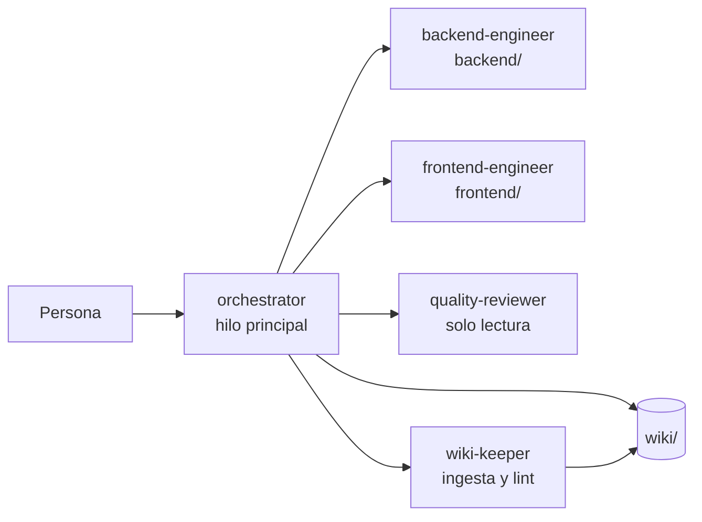

# Trabajar con el agente

El repositorio trae un equipo de agentes para Claude Code. Al ejecutar `claude` en la raíz, la sesión corre como el **orquestador**, que consulta esta wiki, delega en especialistas, verifica con comandos reales y **actualiza la wiki en cada interacción**.

## El equipo de agentes

| Agente | Archivo | Qué hace |
|---|---|---|
| `orchestrator` | `.claude/agents/orchestrator.md` | Orienta, planifica, delega, verifica y cierra la wiki |
| `backend-engineer` | `.claude/agents/backend-engineer.md` | .NET 10 hexagonal, Identity, SignalR, EF Core |
| `frontend-engineer` | `.claude/agents/frontend-engineer.md` | React 19 MVC, cliente SignalR |
| `quality-reviewer` | `.claude/agents/quality-reviewer.md` | Arquitectura, invariantes del PRD, seguridad, pruebas |
| `wiki-keeper` | `.claude/agents/wiki-keeper.md` | Ingesta de fuentes, lint de la wiki |

Las reglas comunes (esquema de la wiki, protocolo por interacción, invariantes) están en `AGENTS.md`, que también leen otras herramientas como Codex.

## Ciclo de cada interacción

1. **Orientarse** en `index.md`, páginas relacionadas y últimas entradas de `log.md`.
2. **Clasificar** la petición y **planificar** si no es trivial.
3. **Delegar** en especialistas (en paralelo cuando hay contrato definido).
4. **Verificar** con build, pruebas y Docker.
5. **Actualizar la wiki**: páginas afectadas, `index.md` si hay páginas nuevas y entrada en `log.md`.
6. **Responder** con lo hecho, lo verificado y las páginas tocadas.

Un hook `Stop` (`.claude/hooks/wiki-guard.mjs`) devuelve el turno una vez si quedan cambios fuera de `wiki/` posteriores a la última entrada del log.

## Skills del proyecto

Skills de terceros instaladas a nivel de proyecto en `.claude/skills/` y registradas en `skills-lock.json` (fuente y hash), para que todo el equipo tenga las mismas.

| Skill | Fuente | Qué aporta |
|---|---|---|
| `using-agent-skills` | `addyosmani/agent-skills` | Meta-skill: elegir la skill o el flujo adecuado según la fase del trabajo y normas generales (explicitar supuestos, cuestionar cuando haga falta, mantener el alcance, verificar antes de cerrar) |

Para instalar otra skill: `npx skills add <repo> --skill <nombre> -a claude-code --copy -y` (`--copy` evita enlaces simbólicos en Windows). Para restaurarlas desde el lock: `npx skills experimental_install`.

> [!warning] Alcance limitado
> `using-agent-skills` remite a unas 24 skills hermanas (`spec-driven-development`, `incremental-implementation`, `code-review-and-quality`…) y a `references/definition-of-done.md`, que **no** están instaladas. Si una de esas skills no existe, manda el flujo de `AGENTS.md` y del orquestador (§3 de precedencia: las instrucciones del proyecto van primero).

## Ejemplos de peticiones

| Quieres… | Pide algo como |
|---|---|
| Implementar | "Implementa la radicación de tickets con adjuntos (CA-09)" |
| Consultar | "¿Qué puede ver un administrador antes de tomar un ticket?" |
| Ingerir una fuente | "Ingiere `wiki/raw/acta-2026-10-10.md`" |
| Decidir | "Propón un ADR para elegir el enrutador del frontend" |
| Revisar la wiki | "Haz lint de la wiki" |
| Revisar código | "Revisa los cambios de esta rama antes del PR" |

## Abrir la wiki en Obsidian

*Open folder as vault* → carpeta `wiki/`. Empieza por `index.md`; la vista de grafo muestra las conexiones. Las plantillas están en `plantillas/` (plugin *Templates*). Opcional: el plugin comunitario *Dataview* aprovecha el frontmatter (`type`, `status`, `tags`).

## Ajustes personales

- `claude --agent <nombre>` abre una sesión con otro agente.
- `.claude/settings.local.json` y `CLAUDE.local.md` son personales y no se versionan.

## Relacionado

- [[flujo-de-trabajo-github]] · [[fuente-patron-llm-wiki]] · [[index]]
