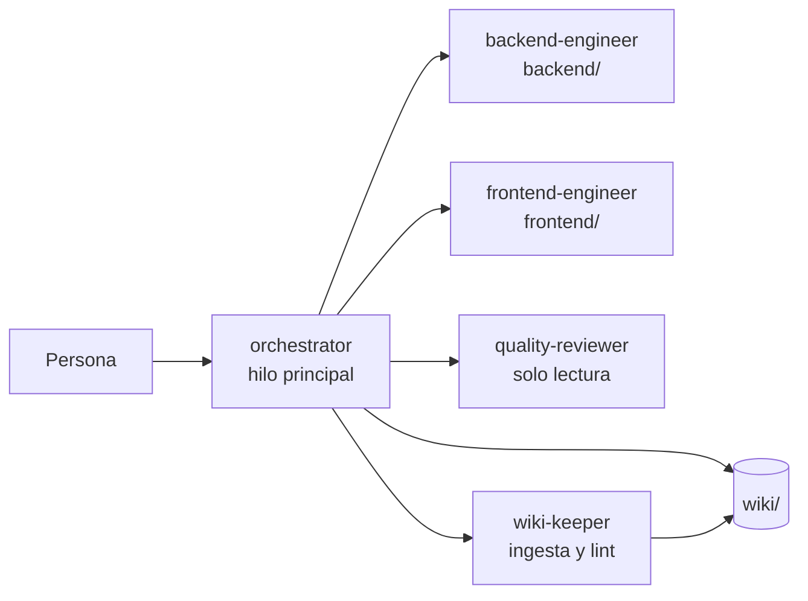

# Trabajar con el agente

El repositorio trae un equipo de agentes para Claude Code. Al ejecutar `claude` en la raíz, la sesión corre como el **orquestador**, que consulta esta wiki, delega en especialistas, verifica con comandos reales y **actualiza la wiki en cada interacción**.

## El equipo de agentes

| Agente | Archivo | Qué hace |
|---|---|---|
| `orchestrator` | `.claude/agents/orchestrator.md` | Orienta, planifica, delega, verifica y cierra la wiki |
| `backend-engineer` | `.claude/agents/backend-engineer.md` | .NET 10 hexagonal, Identity, SignalR, EF Core; ejecuta HU desde su nota (ver abajo) |
| `frontend-engineer` | `.claude/agents/frontend-engineer.md` | React 19 MVC, cliente SignalR; ejecuta HU desde su nota (ver abajo) |
| `quality-reviewer` | `.claude/agents/quality-reviewer.md` | Arquitectura, invariantes del PRD, seguridad, pruebas |
| `wiki-keeper` | `.claude/agents/wiki-keeper.md` | Ingesta de fuentes, lint de la wiki |

Las reglas comunes (esquema de la wiki, protocolo por interacción, invariantes) están en `AGENTS.md`, que también leen otras herramientas como Codex.

## Ciclo de cada interacción

1. **Orientarse** en `index.md`, páginas relacionadas y últimas entradas de `log.md`.
2. **Clasificar** la petición y **planificar** si no es trivial.
3. **Delegar** en especialistas (en paralelo cuando hay contrato definido).
4. **Verificar** con build, pruebas y Docker.
5. **Actualizar la wiki**: páginas afectadas, `index.md` si hay páginas nuevas y entrada en `log.md`.
6. **Responder** con lo hecho, lo verificado y las páginas tocadas.

Un hook `Stop` (`.claude/hooks/wiki-guard.mjs`) devuelve el turno una vez si quedan cambios fuera de `wiki/` posteriores a la última entrada del log.

## Ejecutar una HU de backend

`backend-engineer` está preparado para las HU de Sprint 0 (HU-003, HU-004) y del chat ([[ep-009-chat-interno-en-tiempo-real]], HU-026 a HU-032) sin que el orquestador le repita el contexto.

- **Qué le pasa el orquestador:** la HU (por ejemplo, "ejecuta HU-026") y el **contrato T-01 ratificado**. Si el contrato no llega ratificado o choca con la nota o con las propuestas P-xx de [[pendientes]] §3b, el agente pregunta antes de codificar.
- **Qué hace:**
  1. Lee la nota de la HU y las páginas que le corresponden.
  2. Comprueba con Glob/Grep qué existe ya en el código.
  3. Se detiene si falta una HU prerrequisito (por ejemplo, `Ticket`/`TicketParticipant` antes del chat).
  4. Escribe primero, en rojo, las pruebas con los nombres exactos del DoD; luego implementa hasta verde.
- **Convenciones que aplica sin que se le pidan:**
  - ProblemDetails RFC 9457 y 404 para recursos no visibles (P-01).
  - Códigos estables del hub: `ticket_not_accessible`, `validation_failed`, `internal_error`.
  - `IClock` sobre `TimeProvider`, Guid v7, `CreatedAt` truncado a microsegundos y `Cache-Control: no-store`.
  - Identity sin `MapIdentityApi`, con antiforgery por filtro y *fallback* autenticado.
  - SignalR con el orden autorizar → persistir → publicar, revocación con `TicketAccessRevoked` y validación de `Origin` (P-13).
  - Pruebas de integración en `DataTicket.IntegrationTests` con PostgreSQL real y varios clientes SignalR autenticados con cookie.
- **Qué devuelve:**
  - archivos tocados;
  - comandos con su salida real;
  - la tabla **«Evidencia CHU/DoD»**, lista para pegar en la sección *Evidencia de validación* de la HU (`Validado`, `Falla`, `Pendiente` o `Bloqueado`);
  - **Notas para la wiki**.
- **Memoria propia** (`memory: project`): `.claude/agent-memory/backend-engineer/` guarda trampas y versiones verificadas que no están en la wiki. Se versiona con el repo; revísala en los PR como cualquier otro archivo.
- **`backend/CLAUDE.md`:** reglas críticas que Claude Code carga al trabajar en `backend/`:
  - ejecutar `dotnet` desde esa carpeta;
  - respetar las capas;
  - comandos habituales;
  - prohibición de `MapIdentityApi`.

## Ejecutar una HU de frontend

`frontend-engineer` ejecuta, sin que se le repita el contexto, la parte frontend de HU-002, HU-003 y HU-004 y del chat (HU-026 a HU-032).

**Funcionamiento.** Recibe la HU y el **contrato T-01 ratificado**, inventaría el código antes de planificar y escribe primero las pruebas Vitest con los nombres del DoD.
- **Enrutador:** se **detiene y pregunta** mientras no haya un ADR aceptado sobre «Enrutador y librería de estado del frontend» (decisión abierta en [[tablero-scrum]] y [[pendientes]] §4). Mientras tanto avanza en lo que no depende de él: `core/http`, modelos, controladores y vistas.
- **Pruebas de vistas:** usa Testing Library + jsdom, activado por archivo con `// @vitest-environment jsdom`.

**Qué aplica sin que se le pida:**
- **`core/http`:**
  - `postJson`, `putJson`, `patchJson` y `deleteRequest`;
  - token antiforgery en memoria, invalidado tras login y logout;
  - `HttpError` con ProblemDetails;
  - 401 → `/ingresar?returnUrl=` saneado y 403 → vista «sin permiso».
- **`core/realtime`:**
  - una única `HubConnection` con `withAutomaticReconnect`;
  - resincronización tras `onreconnected` (`JoinTicket` y luego `after` del último cursor);
  - `mergeMessages` deduplica por `id`; `parseHubError` vive en los modelos;
  - con `TicketAccessRevoked`, la vista se vacía y muestra un aviso.
- **MVC estricto:** el portal del cliente nunca importa el módulo `chat`; al crear el portal, el agente añade la regla de oxlint que lo impide.
- **Seguridad y UX:**
  - ningún token en el almacenamiento del navegador;
  - accesibilidad con `role="alert"`/`role="status"`, foco y etiquetas;
  - fechas en `America/Bogota`;
  - tokens de `styles/` con estados `:hover` y `:focus-visible`.

**Qué devuelve:**
- archivos y dependencias, verificadas en npm con su versión exacta;
- salida real de `lint`, `test` y `build`;
- tabla «Evidencia CHU/DoD»;
- **pasos de verificación manual en el navegador** que ejecuta el orquestador;
- Notas para la wiki.

**Memoria y reglas locales.** Su memoria propia está en `.claude/agent-memory/frontend-engineer/` y se versiona. `frontend/CLAUDE.md` tiene las reglas críticas y los comandos.

## Skills del proyecto

Skills de terceros instaladas a nivel de proyecto en `.claude/skills/` y registradas en `skills-lock.json` (fuente y hash), para que todo el equipo tenga las mismas.

| Skill | Fuente | Qué aporta |
|---|---|---|
| `using-agent-skills` | `addyosmani/agent-skills` | Meta-skill: elegir la skill o el flujo adecuado según la fase del trabajo y normas generales (explicitar supuestos, cuestionar cuando haga falta, mantener el alcance, verificar antes de cerrar) |
| `apple-design` | `emilkowalski/skill` | Estilo Apple para la web: movimiento físico con resortes, materiales y profundidad, tipografía; precargada en `frontend-engineer` ([[sistema-de-diseno]]) |
| `emil-design-eng` | `emilkowalski/skill` | Filosofía de pulido de UI y componentes; precargada en `frontend-engineer` ([[sistema-de-diseno]]) |
| `animate`, `review-animations`, `improve-animations`, `find-animation-opportunities`, `animation-vocabulary` | `emilkowalski/skill` | Construir, revisar y auditar el movimiento con la curva y las duraciones de [[sistema-de-diseno]] |
| `break-ui` | `emilkowalski/skill` | Poner a prueba una vista con datos extremos antes de cerrarla |
| `mobile-native`, `pick-ui-library`, `prototype`, `ask-sonner` | `emilkowalski/skill` | Ajustes para móvil, elección de librerías (requiere ADR antes de añadir una), variantes de UI y *toasts* con Sonner |
| `animate-expo`, `write-swift` | `emilkowalski/skill` | React Native/Expo y Swift: sin uso en el MVP web; disponibles para una futura app nativa |

Las 14 skills de `emilkowalski/skill` se instalaron el 2026-10-09 con `--copy`. Son solo Markdown (sin scripts) y se revisaron antes de activarlas.

Para instalar otra skill: `npx skills add <repo> --skill <nombre> -a claude-code --copy -y` (`--copy` evita enlaces simbólicos en Windows). Para restaurarlas desde el lock: `npx skills experimental_install`.

> [!warning] Alcance limitado
> `using-agent-skills` remite a unas 24 skills hermanas (`spec-driven-development`, `incremental-implementation`, `code-review-and-quality`…) y a `references/definition-of-done.md`, que **no** están instaladas. Si una de esas skills no existe, manda el flujo de `AGENTS.md` y del orquestador (§3 de precedencia: las instrucciones del proyecto van primero).

## Ejecución automatizada: goal y loop

Las construcciones largas se lanzan desde archivos de control de la raíz, con una lista de chequeo que Claude marca solo tras verificar y que el equipo puede consultar en cualquier momento ([[plan-goal-login-y-loop-chat]]):

| Archivo | Comando | Construye |
|---|---|---|
| `goal_login.md` | `/goal …` (texto exacto en el archivo) | HU-002, HU-003 y HU-004 (Sprint 0) |
| `loop_chat.md` | `/loop …` (texto exacto en el archivo) | EP-009, HU-026 a HU-032, una rebanada por iteración |

- Ejecútalos en modo auto. El stack de Compose ya está levantado y Claude ejecuta aquí todos los comandos de Docker. Para probar algo que el stack no tiene, crea contenedores desechables (`dt-*-check`) y los elimina al terminar.
- El avance se sigue en las casillas, en el «Registro» de cada archivo y en `git log`.
- `/goal` sin argumentos muestra el estado del goal y `/goal clear` lo detiene; `Esc` detiene el loop.

## Ejemplos de peticiones

| Quieres… | Pide algo como |
|---|---|
| Implementar | "Implementa la radicación de tickets con adjuntos (CA-09)" |
| Consultar | "¿Qué puede ver un administrador antes de tomar un ticket?" |
| Ingerir una fuente | "Ingiere `wiki/raw/acta-2026-10-10.md`" |
| Decidir | "Propón un ADR para elegir el enrutador del frontend" |
| Revisar la wiki | "Haz lint de la wiki" |
| Revisar código | "Revisa los cambios de esta rama antes del PR" |

## Abrir la wiki en Obsidian

*Open folder as vault* → carpeta `wiki/`. Empieza por `index.md`; la vista de grafo muestra las conexiones. Las plantillas están en `plantillas/` (plugin *Templates*). Opcional: el plugin comunitario *Dataview* aprovecha el frontmatter (`type`, `status`, `tags`).

## Ajustes personales

- `claude --agent <nombre>` abre una sesión con otro agente.
- `.claude/settings.local.json` y `CLAUDE.local.md` son personales y no se versionan.

## Relacionado

- [[flujo-de-trabajo-github]] · [[fuente-patron-llm-wiki]] · [[index]]
