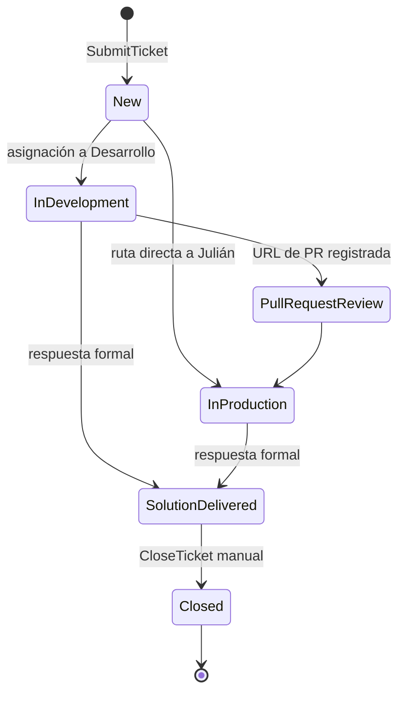

# Estados del ticket

Un ticket tiene un **estado interno** que describe el trabajo real y un **estado resumido** seguro para el cliente. El cliente nunca ve en qué etapa técnica está su caso (PRD §6.4).

## Tabla de correspondencia

| Estado interno | `TicketStatus` | Significado | Estado del cliente | `ClientStatus` |
|---|---|---|---|---|
| Nuevo / pendiente de triage | `New` | Recibido; espera clasificación y asignación | Recibido | `Received` |
| En desarrollo | `InDevelopment` | Análisis o implementación por Desarrollo | En atención | `InProgress` |
| Revisión de PR | `PullRequestReview` | Revisión técnica previa a Producción | En atención | `InProgress` |
| En producción | `InProduction` | Despliegue o validación en Producción | En atención | `InProgress` |
| Solución entregada | `SolutionDelivered` | La PM o un administrador envió la respuesta formal final | Solución entregada | `SolutionDelivered` |
| Cerrado | `Closed` | La PM o un administrador cerró manualmente tras confirmación verbal | Cerrado | `Closed` |

Fuente: (PRD §6.4). La correspondencia es de muchos a uno: tres estados internos colapsan en `InProgress`.

## Diagrama de estados

> [!question] Transiciones a validar
> El PRD define los estados y su significado, no una máquina de transiciones. Las flechas reflejan el flujo narrado en (PRD §6.2–§6.5). Son inferidas y deben confirmarse: `New → InProduction` (ruta directa), `InDevelopment → SolutionDelivered` (sin paso a Producción), retrocesos (p. ej. PR rechazado) y reapertura de un ticket cerrado. Tampoco se indica quién mueve los estados internos. Ver [[pendientes]].

## Reglas firmes

- Todo ticket nace en `New` y entra a la cola de triage (PRD §6.2).
- Solo Elizabeth o un administrador lleva el ticket a `SolutionDelivered` (al emitir la respuesta formal) y a `Closed` (por acción manual) (PRD §5, §6.5).
- No hay cierre automático, vencimiento ni recordatorios (PRD §6.5, §14.12).
- Al cerrar se conserva quién cerró, cuándo y el **estado anterior** (PRD §6.5).
- Cada cambio de estado se audita con actor y fecha/hora (PRD §12, §14.14). Ver [[auditoria]].

## Lo que el cliente nunca ve

- Si el trabajo está en Desarrollo, revisión de PR o Producción (PRD §6.4, §14.10).
- Chat interno, notas internas ni adjuntos internos (PRD §5, §10).
- URL de pull request (PRD §5, §14.10).
- Nombres de colaboradores o participantes internos de Data Global (PRD §5, §10).
- Reasignaciones, cambios de participantes ni actividad privada de otros clientes (PRD §5, §6.4).

## Notificación de cambios

| Cambio | Efecto |
|---|---|
| Estado interno | Se refleja en las bandejas internas; no se revela por correo al cliente (PRD §11) |
| Estado resumido | Se refleja en el portal; el correo automático por transición no está garantizado en el MVP (PRD §11) |

Ver [[notificaciones]].

## Relacionado

- [[flujo-del-ticket]] · [[roles-y-permisos]] · [[notificaciones]] · [[auditoria]]
- [[dashboard-y-metricas]] · [[modelo-de-dominio]] · [[glosario]]
- [[criterios-de-aceptacion]] · [[fuente-prd-v0-1]]
