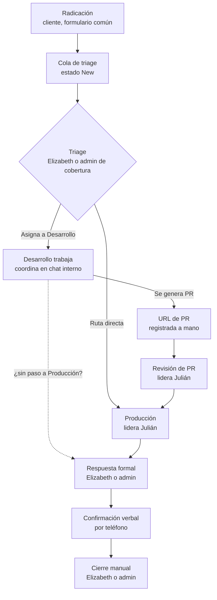

# Flujo del ticket

Ciclo de vida completo de un ticket: el cliente lo radica, Elizabeth (PM) hace triage y asigna, Desarrollo y/o Producción lo trabajan coordinándose en el chat interno, y la PM o un administrador entrega la respuesta formal y lo cierra manualmente (PRD §6).

## Diagrama

La flecha punteada no está descrita explícitamente en el PRD: §6.3 dice que la revisión de PR aplica "cuando el ticket requiere paso a Producción", lo que sugiere tickets que no pasan por Producción (ver [[pendientes]]).

## 1. Radicación

- Un usuario cliente autenticado crea el ticket con el formulario común del piloto (PRD §6.1, §9).
- La **cuenta** determina empresa y solicitante; no se eligen en el formulario (PRD §6.1).
- Campos: categoría, título (≤ 120 caracteres), descripción, urgencia, impacto, prioridad calculada y adjuntos opcionales (PRD §6.1). Ver [[matriz-de-prioridad]] y [[archivos-adjuntos]].
- La radicación queda en la auditoría (PRD §12). Caso de uso: `SubmitTicket` ([[glosario]]).

## 2. Triage y asignación

- El ticket entra a la cola general de Elizabeth con estado interno **Nuevo / pendiente de triage** (`New`) (PRD §6.2).
- Elizabeth revisa categoría, urgencia e impacto y asigna **una o varias** personas; puede asignarlo directamente a Julián si es de Producción (PRD §6.2).
- Si Elizabeth está ausente, un administrador cubre el triage con una vista restringida de la cola; ver [[roles-y-permisos]] (PRD §5, §6.2).
- Elizabeth o un administrador puede añadir o retirar participantes durante toda la vida del ticket; cada cambio se audita (PRD §6.2).
- Asignar a un **equipo** no da acceso: el detalle y el chat requieren asociación explícita como participante, salvo Elizabeth (PRD §6.2, §10).
- La primera asociación de una persona dispara un correo de vinculación (PRD §7, §11).

## 3. Trabajo de Desarrollo y Producción

| Paso | Quién | Qué ocurre |
|---|---|---|
| Desarrollo | Uno o más desarrolladores | Análisis o implementación; coordinación en [[chat-interno]] (PRD §6.3) |
| Pull request | Persona autorizada | Registra **a mano** la URL del PR (`PullRequestUrl`); solo la ven internos autorizados (PRD §6.3) |
| Revisión de PR | Julián lidera | Cuando el ticket requiere paso a Producción (PRD §6.3) |
| Producción | Julián lidera | Despliegue o validación; el desarrollador puede seguir asociado (PRD §6.3) |
| Ruta directa | Julián | Tickets de Producción asignados a él sin pasar por Desarrollo (PRD §6.2, §6.3) |

- No hay integración automática con GitHub, GitLab u otro proveedor; los repositorios son privados (PRD §6.3, §13).

## 4. Respuesta formal

- Único canal para comunicar el resultado al cliente: texto + archivos, visible en el portal y enviada completa por correo (PRD §6.5, §11).
- Solo Elizabeth o un administrador la emite; los desarrolladores preparan contexto y adjuntos en el chat (PRD §5, §6.5).
- El ticket pasa a **Solución entregada** (`SolutionDelivered`) (PRD §6.4).

## 5. Cierre manual

- Elizabeth confirma verbalmente con el cliente por teléfono; el sistema no graba ni transcribe la llamada (PRD §6.5).
- Elizabeth o un administrador registra el cierre (`CloseTicket`); se guarda quién cerró, cuándo y el estado anterior (PRD §6.5).
- No hay cierre automático, temporizador de vencimiento ni recordatorios (PRD §6.5, §14.12).

> [!question] Pendiente
> El PRD define los estados (PRD §6.4) pero no quién registra cada transición interna (p. ej. `InDevelopment` → `PullRequestReview`), qué estado toma un ticket de ruta directa ni si un ticket cerrado puede reabrirse. Ver [[estados-del-ticket]] y [[pendientes]].

## Relacionado

- [[estados-del-ticket]] · [[matriz-de-prioridad]] · [[roles-y-permisos]]
- [[chat-interno]] · [[archivos-adjuntos]] · [[notificaciones]] · [[auditoria]]
- [[elizabeth-pm]] · [[julian-produccion]] · [[equipo-data-global]]
- [[modelo-de-dominio]] · [[glosario]] · [[fuente-prd-v0-1]]
