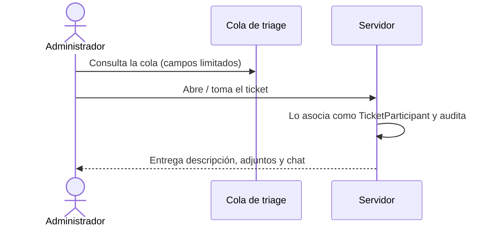

# Roles y permisos

Quién puede ver y hacer qué en DataTicket. La autorización se aplica **en servidor en cada operación**; ocultar algo en la interfaz no es aislamiento (PRD §5, §12).

## Perfiles

| Perfil | Código | Superficie | Puede | No puede |
|---|---|---|---|---|
| Solicitante | `Requester` | Portal del cliente | Radicar; ver sus propios tickets, estado resumido y respuesta formal | Ver chat interno ni tickets ajenos (PRD §5) |
| Coordinador de empresa | `CompanyCoordinator` | Portal del cliente | Radicar; ver todos los tickets de su empresa | Ver chat interno ni otras empresas (PRD §5) |
| PM (Elizabeth) | rol `ProductManager` | Espacio interno | Ver todos los tickets; triage; asignar y reasignar; gestionar participantes; acceder siempre al chat; respuesta formal; cierre (PRD §5, §6.5) | — |
| Administrador | `Administrator` | Espacio interno | Administrar el sistema; agregar o retirar participantes; cubrir triage; respuesta formal; cierre (PRD §5, §6.5) | Ver mensajes y archivos solo por ser admin (PRD §5) |
| Desarrollo | `Team.Development` | Espacio interno | Trabajar y chatear en los tickets **a los que está asociado** (PRD §5) | Ver detalle o chat sin asociación (PRD §6.2, §10) |
| Producción | `Team.Production` | Espacio interno | Casos de Producción; Julián lidera (PRD §5) | Ídem Desarrollo |

Personas concretas del piloto: [[equipo-data-global]].

## Las 7 reglas de autorización (PRD §5)

1. **Aislamiento por empresa.** Un usuario cliente solo consulta tickets de su empresa: el solicitante los propios, el coordinador los de toda la empresa.
2. **Servidor siempre.** Se autoriza en backend en cada operación; ocultar filas en la UI no cuenta.
3. **Chat solo para participantes vigentes.** Excepción: Elizabeth siempre accede para triage y seguimiento.
4. **Gestión de participantes.** PM y administradores agregan o retiran. Agregar da acceso al historial completo; retirar revoca el acceso futuro y conserva la participación pasada en historial y auditoría.
5. **El admin no ve contenido por ser admin.** En cobertura ve solo los campos de la cola; al tomar un ticket queda asociado **antes** de cargar detalle y adjuntos.
6. **Opacidad hacia el cliente.** Nunca ve mensajes internos, estados técnicos, URL de PR, nombres de colaboradores internos ni actividad privada de otros clientes.
7. **Respuesta formal restringida.** Solo Elizabeth o un administrador la envía.

## Cobertura de triage por un administrador

Durante la ausencia de Elizabeth (PRD §5, §6.2, §10):

| Visible en la cola (antes de asociarse) | Oculto hasta asociarse |
|---|---|
| Número, empresa, título, categoría, urgencia, impacto, prioridad calculada, fecha de creación, estado resumido | Descripción completa, archivos, chat |

La asociación ocurre **antes** de entregar el detalle (PRD §5, §14.3).

> [!question] Pendiente
> El PRD no define cómo se determina la "ausencia" de Elizabeth: ¿la cola de cobertura está siempre disponible para administradores o se activa de algún modo? Ver [[pendientes]].

## Aislamiento multiempresa (PRD §12)

- Cada ticket pertenece a una empresa cliente; toda consulta del portal se filtra por empresa y permisos en servidor.
- La capa de datos debe evitar consultas accidentales entre empresas; se recomienda evaluar filtros globales y seguridad a nivel de fila de PostgreSQL. Ver [[persistencia-postgresql]].
- Excepción conocida: los archivos con URL pública. Ver [[archivos-adjuntos]].

## Ciclo de vida de cuentas

- **Sin registro público.** Data Global crea, invita y desactiva las cuentas de empresas cliente (PRD §5).
- **Invitación y restablecimiento seguros**, sin revelar si un correo está registrado; token de un solo uso (PRD §5, §12).
- Contraseñas con una solución estándar de identidad y derivación segura; nada de cifrado reversible ni hash casero (PRD §12). Ver [[autenticacion-identity]].
- Todo acceso exige autenticación, salvo páginas de entrada expresamente públicas (PRD §12).
- **MFA, SSO y federación** quedan fuera del MVP (PRD §5, §13).
- La lista inicial de personas es para el piloto; las futuras se administran dentro de DataTicket (PRD §5).

## Relacionado

- [[autenticacion-identity]] · [[adr-0004-autenticacion-cookie-mismo-origen]]
- [[chat-interno]] · [[flujo-del-ticket]] · [[estados-del-ticket]] · [[auditoria]]
- [[elizabeth-pm]] · [[equipo-data-global]] · [[glosario]] · [[criterios-de-aceptacion]]
